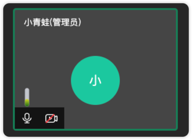
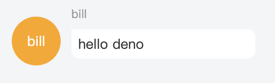
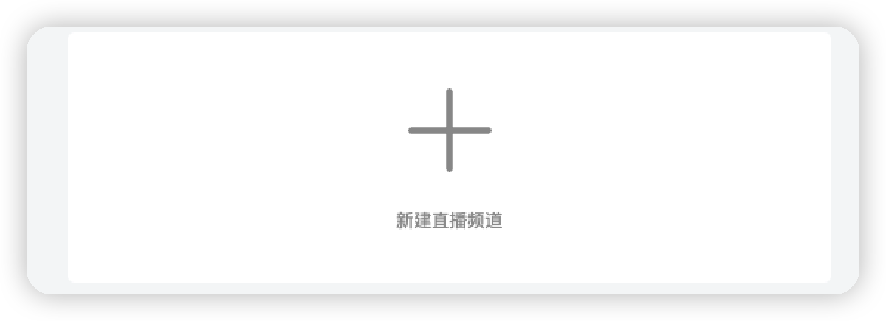
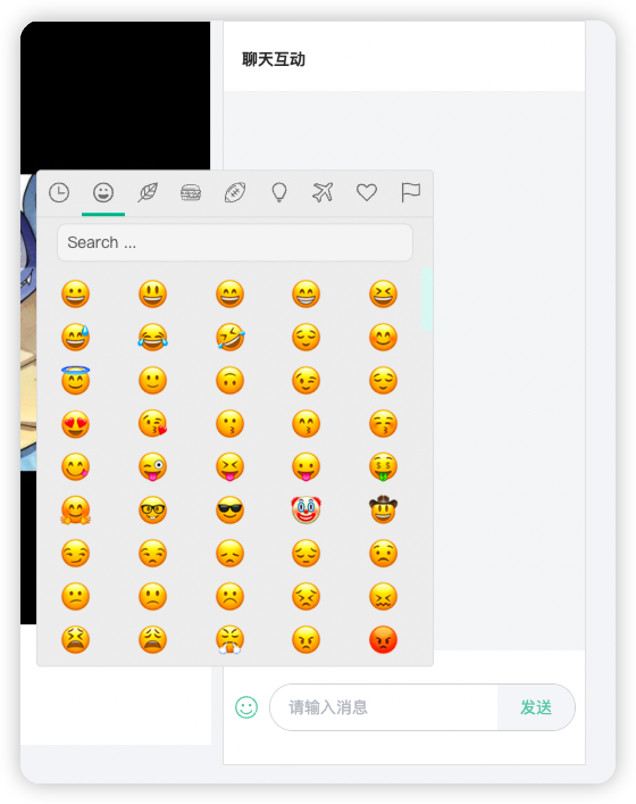

# 目录
+ <a href="#Vue">Vue</a>

 

## <a id="Vue">Vue</a>
- 登陆组件
  

 

- 分享组件
  

 

- 回放直播录屏项

  

 

- 会议直播间视频项
  

 

- 聊天块
  

 

- 聊天块
  

 

- 直播间聊天项

  

 

- 小卡片1

  

 

- 小卡片2

  

 

- 头部操作栏
  

 

- 聊天盒子

  

 