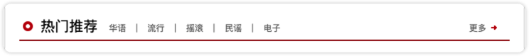
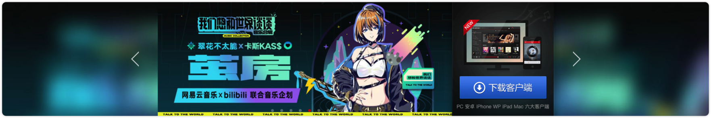
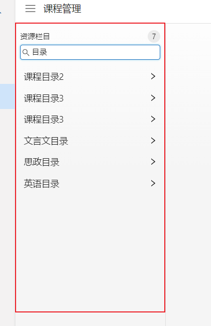
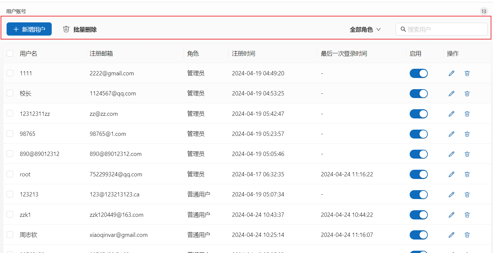
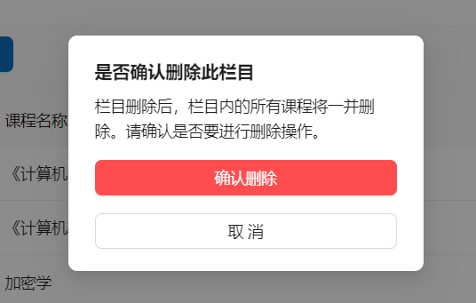

# 目录

- <a href="#AntDesign">`AntDesign`</a>

## <a id="AntDesign">`AntDesign`</a>

- 头部

  - header

    

  - nav header

    

  - ContentHeaderV1

    

- 轮播图

  - swiper

    

- item 组件

  - 歌单 item

    

- 目录组件 + 目录item组件
  

- 工具组件
    - 工具栏
      
- 确认删除组件
    - 确认删除1
      