# 目录

- <a href="#Vue">`Vue`</a>

 

## <a id="Vue">`Vue`</a>

- 登陆组件

  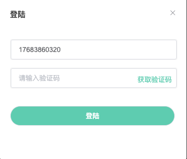

 

- 分享组件 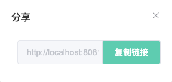  
- 回放直播录屏项

  

 

- 会议直播间视频项

  

 

- 聊天块 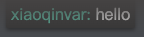

 

- 聊天块输入与发送 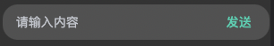

 

- 直播间聊天项

  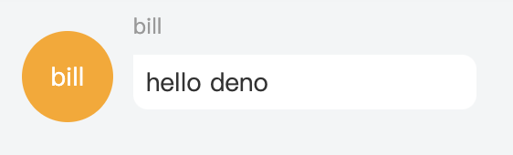

 

- 小卡片 1

  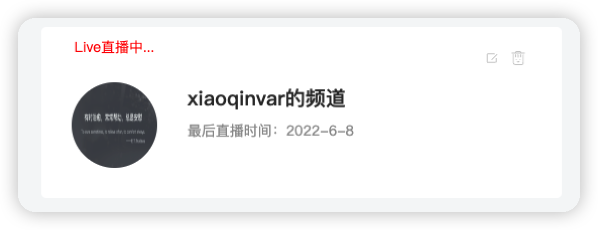

 

- 小卡片 2

  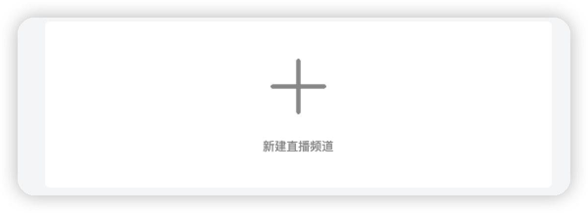

 

- 头部操作栏 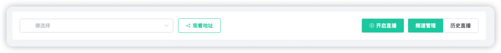

 

- 聊天盒子

  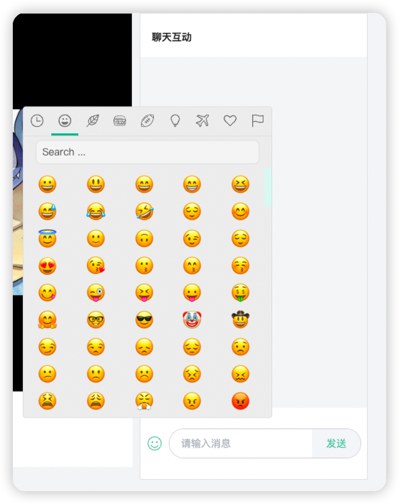

 

- 日期时间输入框组件

  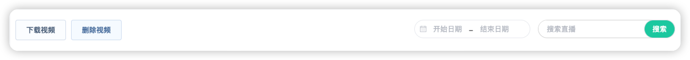

 

- 提示组件

  

 

- 信息栏组件

  

 

- 选择成员 dialog 组件

  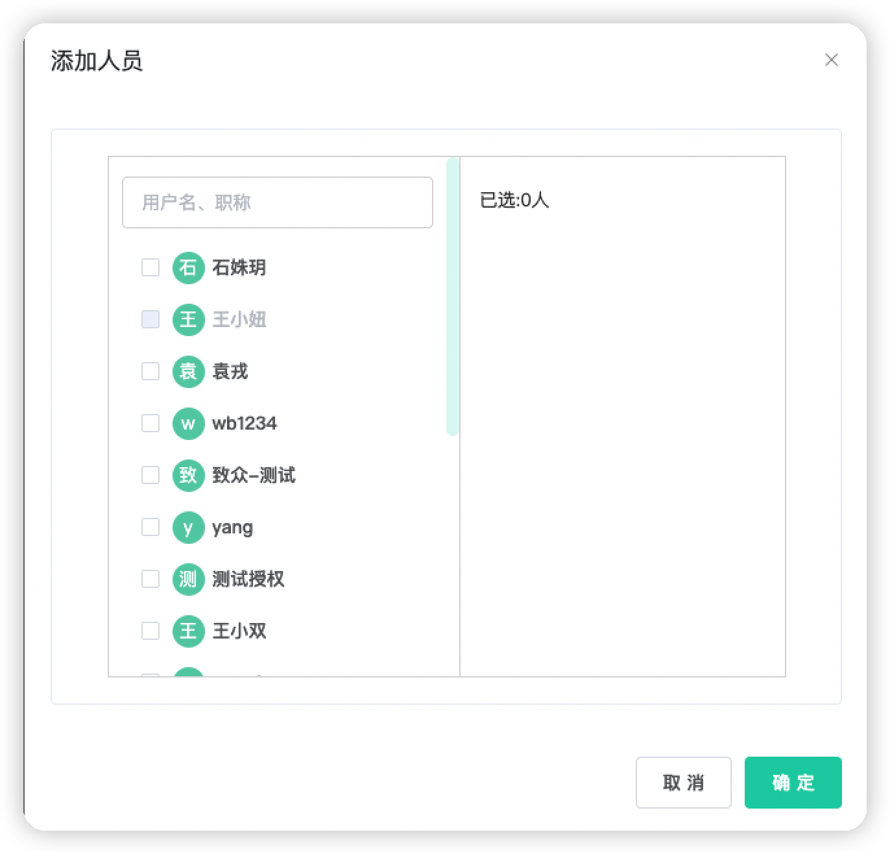

 
